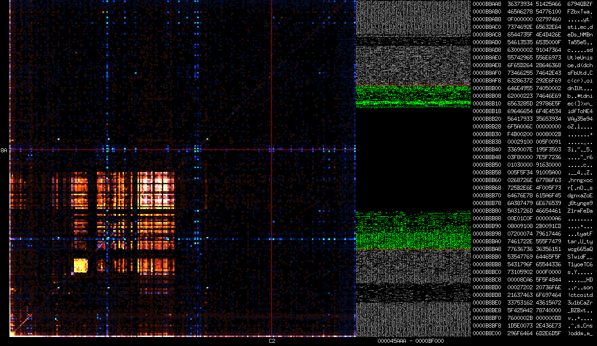

=============================
Lookout: binary visualization
=============================

What is it?
===========

Lookout is a reverse engineering tool that helps visualizing unknown data. It
provides useful insight by presenting a statistical representation that
allows quick identification of the different kind of data that are present in
any file. That representation doesn't rely on parsing and therefore works
just as well on obscure formats even when all other tools fail.

References
==========

I strongly recommend watching `that video`__ from Christopher Domas about Cantor
Dust, a program he wrote and never released that servers the same purpose.

.. _video: https://www.youtube.com/watch?v=4bM3Gut1hIk

__ video_

I used for some years another tool based on the same concept named Veles_
which I liked very much. However its authors decided to go in a direction
that drastically reduced its usability for me (unrealistic file size
limitation, slowdowns, dependency hell, mandatory application server,
clumsier interface...). I also missed some features like being able to
corelate hexdump and visual exploration in real time.

.. _veles: https://codisec.com/veles/

I still recommend the tool in its old ubuntu1604 version if you can grab it.
Furthermore their website is very well made when it comes to explaining the
different kind of graphs that it supports and how they should be interpreted.

Usage
=====

Lookout currently doesn't support any option. Call it as such:

.. code:: shell

    lookout FILE

Building
========

Lookout is written in D. If you have properly configured your development
environment with a compiler (dmd, ldc or gdc) and the Dub package manager you
can do:

.. code:: shell

    dub build

Roadmap
=======

- [+] Digraph
- [+] Binmap
- [+] Hexdump
- [+] Refactor into separate files
- [ ] Reverse search
- [ ] Keyboard control
- [ ] Trigraph
- [ ] Layered digraph
- [ ] Modular binmap
- [ ] Better coloring

License
=======

Lookout is provided under the terms of the MIT licence.

::

    Copyright 2020 Cédric Picard

    Permission is hereby granted, free of charge, to any person obtaining a
    copy of this software and associated documentation files (the
    "Software"), to deal in the Software without restriction, including
    without limitation the rights to use, copy, modify, merge, publish,
    distribute, sublicense, and/or sell copies of the Software, and to permit
    persons to whom the Software is furnished to do so, subject to the
    following conditions:

    The above copyright notice and this permission notice shall be included
    in all copies or substantial portions of the Software.

    THE SOFTWARE IS PROVIDED "AS IS", WITHOUT WARRANTY OF ANY KIND, EXPRESS
    OR IMPLIED, INCLUDING BUT NOT LIMITED TO THE WARRANTIES OF
    MERCHANTABILITY, FITNESS FOR A PARTICULAR PURPOSE AND NONINFRINGEMENT. IN
    NO EVENT SHALL THE AUTHORS OR COPYRIGHT HOLDERS BE LIABLE FOR ANY CLAIM,
    DAMAGES OR OTHER LIABILITY, WHETHER IN AN ACTION OF CONTRACT, TORT OR
    OTHERWISE, ARISING FROM, OUT OF OR IN CONNECTION WITH THE SOFTWARE OR THE
    USE OR OTHER DEALINGS IN THE SOFTWARE.

